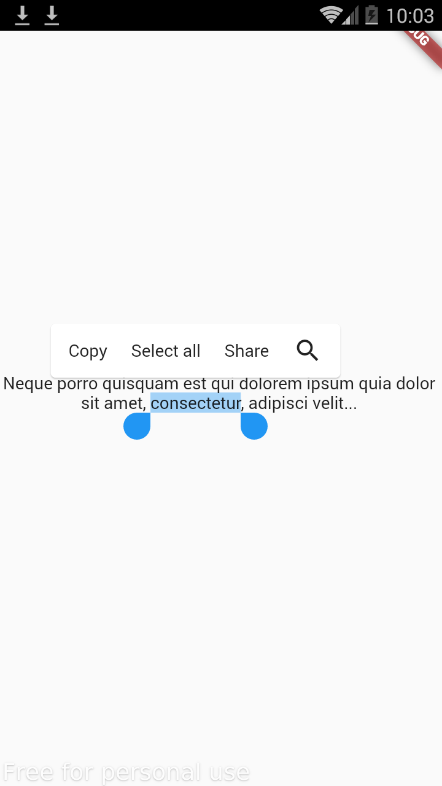

# Custom Selectable Text

This package helps you to select text and perform utilize functionalities like copy. You can also perform custom selectable like share text.

## Screenshot



## Usage
```dart
CustomSelectableText(
  "Neque porro quisquam est qui dolorem ipsum quia dolor sit amet, consectetur, adipisci velit...",
  textAlign: TextAlign.center,
  items: [
    CustomSelectableTextItem(controlType: SelectionControlType.copy),
    CustomSelectableTextItem(
        controlType: SelectionControlType.selectAll),
    CustomSelectableTextItem(
        label: "Share",
        controlType: SelectionControlType.other,
        onPressed: (text) {
          ScaffoldMessenger.of(context).showSnackBar(SnackBar(
            content: Text("$text is successfully shared"),
          ));
        }),
  ],
)
```
